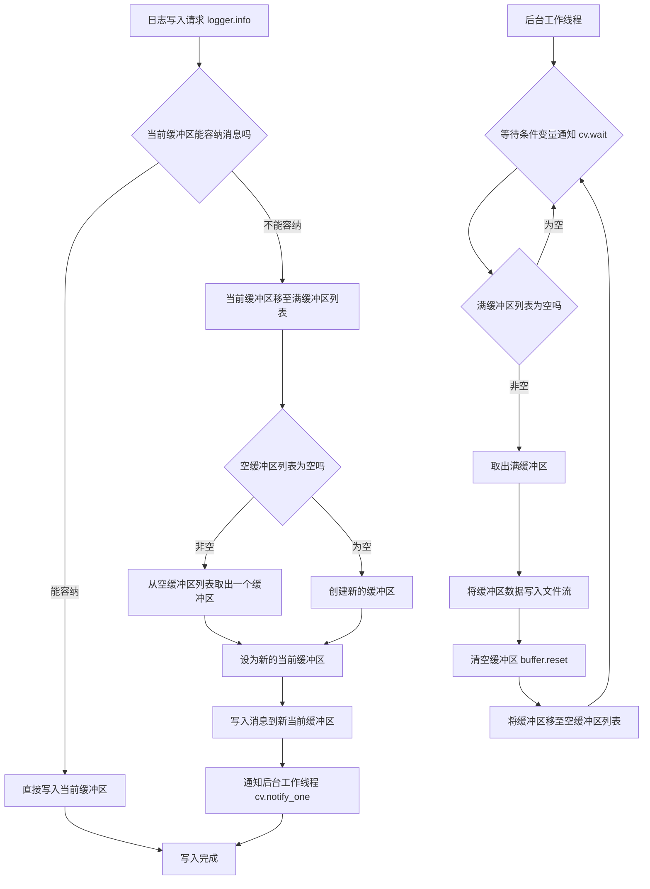
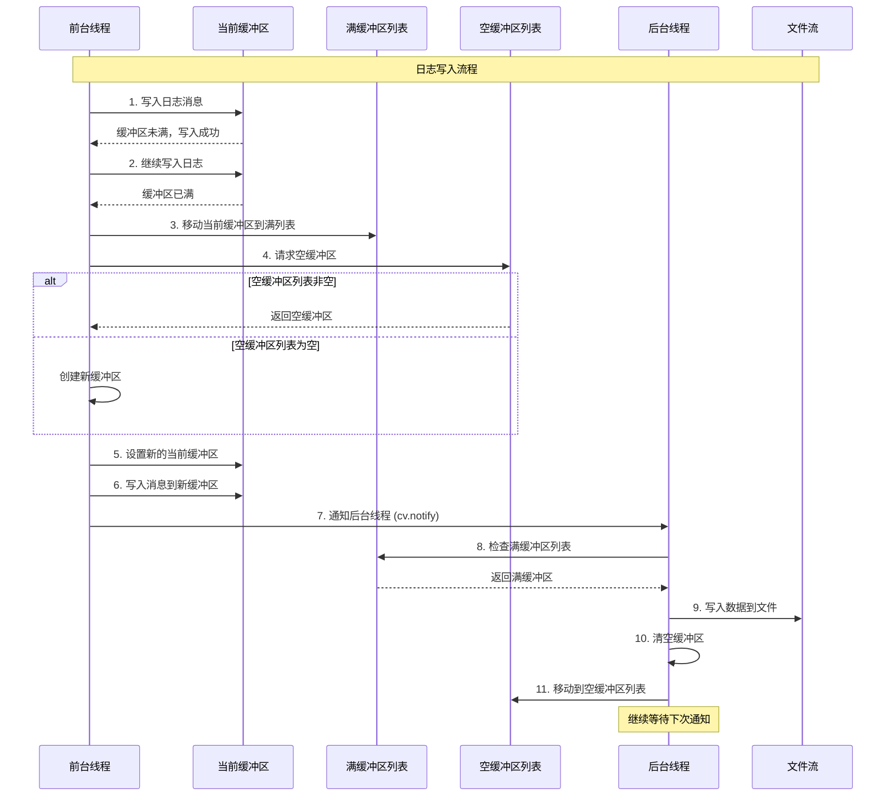

# FastLog - 高性能C++日志系统

## 项目介绍

FastLog是一个基于现代C++23标准开发的高性能日志系统，支持控制台日志和文件日志两种输出方式

## 使用的C++库特性
- C++11 `std::array` `std::thread` `std::mutex` `std::condition_variable`
- C++17 `std::optional` `std::string_view` `std::filesystem`
- C++20 `std::format` `std::source_location` `concepts`
- C++23 `std::print`

## 环境要求
- **编译器**: 支持C++23的编译工具
- **操作系统**: Linux/macOS/Windows
- **构建工具**: CMake

## 快速使用

### 基本使用

```cpp
#include "fastlog/fastlog.hpp"

int main()
{
    // 设置控制台日志最低级别
    fastlog::set_consolelog_level(fastlog::LogLevel::Trace);

    // 控制台日志
    fastlog::console.info("Hello, FastLog! Value: {}", 18);
    fastlog::console.warn("This is a warning");
    fastlog::console.error("This is an error");

    // 文件日志
    // 注册文件日志器
    auto& logger = fastlog::file::make_logger("app_log", FILE_LOG1_PATH);
    logger.info("Application started, user_id: {}", 12345);

    // 获取指定文件日志器
    fastlog::file::get_logger("app_log")->info("hello world");

    return 0;
}
```

## 重要设计和代码实现

### 1. logfstream封装

- **缓冲区优化**: 自定义缓冲区大小，提升I/O性能
- **路径管理**: 自动识别并创建日志目录层次结构
- **时间戳命名**: 自动为轮转文件添加时间戳后缀
- **文件轮转策略**: 基于文件大小的自动轮转，防止单个文件过大

```cpp
class Logfstream
{
    static inline constexpr std::size_t kBufferSize = 1024;
public:
    Logfstream(std::filesystem::path file_path)
        : _file_path(file_path)
    {
        // 如果文件路径有父目录
        auto log_dir = _file_path.parent_path();
        // 如果日志目录不存在，创建目录
        if (!std::filesystem::exists(log_dir))
        {
            std::filesystem::create_directories(log_dir);
        }

        create();
        // 设置文件缓冲区
        _file_stream.rdbuf()->pubsetbuf(_buffer.data(), _buffer.size());
    }

    ~Logfstream()
    {
        _file_stream.close();
    }

    // 刷新文件缓冲区
    void flush()
    {
        _file_stream.flush();
    }

    // 设置单个文件的最大大小
    void set_maxsize(std::size_t maxsize)
    {
        _file_maxsize = maxsize;
    }

    [[nodiscard]]
    auto maxsize() const noexcept -> std::size_t
    {
        return _file_maxsize;
    }

    // 写入日志数据
    void write(const char* data, std::size_t size)
    {
        _file_stream.write(data, size);
        _file_size += size;
        
        // 检查文件大小是否超过最大限制
        if (_file_size > _file_maxsize)
        {
            create();
        }
    }

private:
    // 创建新文件
    void create()
    {
        auto time_str = util::get_current_time_tostring();
        if (time_str.has_value())
        {
            std::filesystem::path log_path = std::format("{}-{}", _file_path.string(), time_str.value());

            _file_size = 0;
            if (_file_stream.is_open())
            {
                _file_stream.close();
            }
            _file_stream.open(log_path, std::ios::out);

            if (!_file_stream.is_open())
            {
                throw std::runtime_error("create log file failed");
            }
        }
    }

private:
    std::ofstream _file_stream{};                   // 文件输出流
    std::filesystem::path _file_path;               // 文件路径
    std::size_t _file_maxsize{100 * 1024 * 1024};   // 单个文件最大大小
    std::array<char, kBufferSize> _buffer;          // 文件输出流缓冲区
    std::size_t _file_size{0};                      // 当前文件大小
};
```

### 2. 基于CRTP

使用CRTP模式实现编译时多态：

```cpp
template <typename DerviceLogger> 
class BaseLogger {
    template <LogLevel LEVEL, typename... Args>
    void format(format_string_wrapper<Args...> fmt_w, Args &&...args) {
        // 调用派生类的log方法
        static_cast<DerviceLogger *>(this)->template log<LEVEL>(record);
    }
};

class ConsoleLogger : public BaseLogger<ConsoleLogger> {
public:
    template <LogLevel level>
    void log(const logrecord_t &record) {}
};

class FileLogger : public BaseLogger<FileLogger> {
public:
    template <LogLevel level>
    void log(const logrecord_t &record) {}
};
```

### 3. 日志格式化参数类封装
```cpp
// 日志格式化参数类，封装日志格式化参数
template <typename... Args>
struct basic_format_string_wrapper {
    template <typename T>
    requires std::convertible_to<T, std::string_view> consteval
        basic_format_string_wrapper(const T &s, std::source_location loc =
            std::source_location::current()): fmt(s), loc(loc) {}
    
    std::format_string<Args...> fmt;
    std::source_location loc;
};

// 重命名格式化字符串包装器，使用std::type_identity_t避免自动类型推导
template <typename... Args>
using format_string_wrapper =
    basic_format_string_wrapper<std::type_identity_t<Args>...>;
```

- 使用`consteval` - 构造函数在编译时执行，确保格式字符串在编译时就被验证
- 使用`std::format_string<Args...>` - 确保格式字符串中的占位符与参数类型匹配，不匹配会编译错误
- 使用`std::source_location::current()` - 自动获取调用日志函数的确切位置
- 使用`std::type_identity_t<Args>...` - 避免类型推导

### 4. 文件异步写入

**1. 基于生产者-消费者模式实现异步写入**
- 分成前端生产者线程和后端消费者线程
- 前端日志写入只操作内存缓冲区，不直接进行文件I/O
- 后台独立线程负责文件写入，避免阻塞主页午逻辑

**2. 三缓冲区机制**
- 当前缓冲区、满缓冲区列表、空缓冲区列表的轮转设计

**3. 缓冲区复用优化**
- 缓冲区池化设计，避免频繁的内存分配和释放
- 有缓冲区回收机制

**4. 过载保护机制**
- 当缓冲区超过15个时自动丢弃多余缓冲区
- 防止内存无限制增长导致系统崩溃

**架构设计**





### 5. 文件日志管理

**基于工厂模式实现文件日志器的创建和管理：**

- 底层存储：使用 `std::unordered_map` 存储文件日志器，键为日志文件名，值为文件日志器对象
- 利用单例模式，提供全局唯一文件日志器管理类对象
- 提供全局函数 `make_logger` 方法基于全局唯一文件日志器管理对象创建文件日志器，参数为日志文件名和文件路径
- 提供全局函数 `delete_logger` 方法基于全局唯一文件日志器管理对象删除文件日志器，参数为日志文件名
- 提供全局函数 `get_logger` 方法基于全局唯一文件日志器管理对象获取文件日志器，参数为日志文件名，返回文件日志器指针


```cpp
class FileLoggerManager : util::noncopyable
{
public:
    FileLogger& make_logger(const std::string& logger_name,
        std::filesystem::path file_path)
    {
        _loggers.emplace(logger_name, file_path);
        return _loggers.at(logger_name);
    }

    void delete_logger(const std::string& logger_name)
    {
        _loggers.erase(logger_name);
    }

    FileLogger* get_logger(const std::string& logger_name)
    {
        if (_loggers.find(logger_name) != _loggers.end())
        {
            return std::addressof(_loggers.at(logger_name));
        }
        return nullptr;
    }

private:
    std::unordered_map<std::string, FileLogger> _loggers;
};

// 文件日志器管理器，单例，全局唯一
inline auto &fileloggermanager =
    detail::util::Singleton<detail::FileLoggerManager>::instance();
// 工厂函数，创建文件日志器
static inline auto make_logger(const std::string &logger_name,
        std::filesystem::path log_path = "") -> detail::FileLogger & {
    if (log_path.empty()) {
        log_path = std::filesystem::path{logger_name};
    }
    if (!log_path.has_filename()) {
        log_path.append(logger_name);
    }
    return fileloggermanager.make_logger(logger_name, log_path);
}
// 删除文件日志器
static inline void delete_logger(const std::string &logger_name) {
    fileloggermanager.delete_logger(logger_name);
}

// 获取文件日志器
[[nodiscard]]
static inline auto get_logger(const std::string &logger_name) {
    return fileloggermanager.get_logger(logger_name);
}
```
